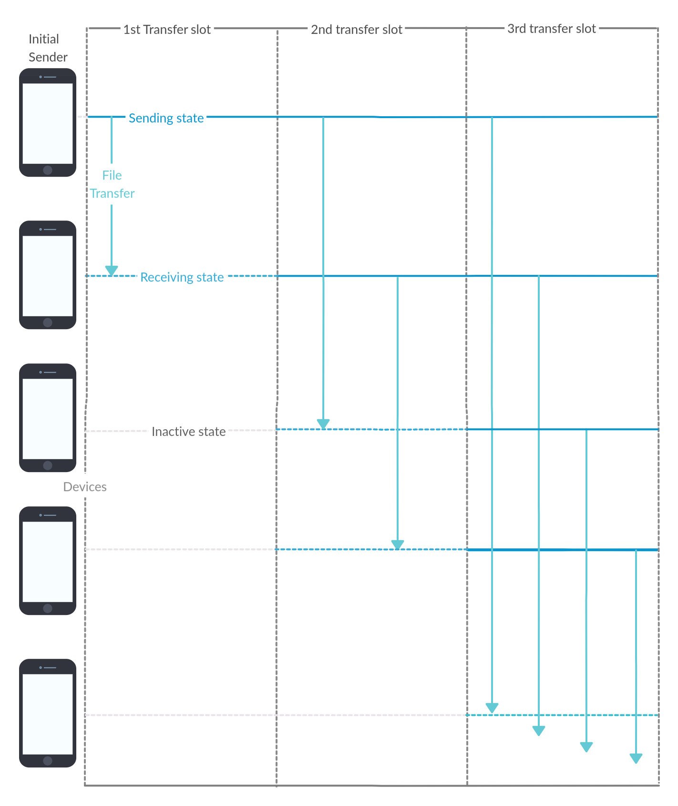

# group-share
An algorithm and architecture to efficiently share files in group
  
We could say SHAREIT is one of the best applications in the play store. It provides ultra easy UI to share files with friends. Have a group? No problem!! SHAREIT provides group share. Hold your horses!! The problem arises if a group is a bit big. The architecture of the group share in the former is not polished enough to provide efficient file transfer within a group. Lets brief into constraints,  
1. Group size constraint 
2. Networking constraint 
 
<b>Group size constraint:</b> 
 
SHAREIT has limited the max group size to be 5. Moreover, it uses hotspot/WIFI to transfer the file, every device has the number of connection limitations too.
  
<b>Networking constraint:</b>
 
It makes every node and the server connected in a single network. So, only one node can receive the file at a time frame, because of collision avoidance. This is similar to, single processor system handling multiple processes.
  
Theoretically, these points prove the inefficiency of SHAREIT group share architecture. We tested practically too, the transfer takes place at snail pace.
 
 
 
<h2>Idea 1</h2>
The concept of seeding is simply great, which made torrents a big thing. Let’s use the same concept with a bit change in network architecture in group share.
  
Initially, the sender gets the hotspot hardware address of the receivers(part to be planned). Once, the request is sent receivers switch on their hotspots and sender switch on its wifi. The first sender connects with the 1st receiver and sends the file. Once the file is sent, the sender sends half of the hotspot hardware addresses collected to the receiver. Now, the receiver becomes a sender and start seeding. At the same time, the original sender sends the file to some other receiver. Again, the process continues until every node gets the file.
  
Congestion and hardware limitation has been solved. 
  
<i>Note: The carrier of several networks may lie in the same collision band in practical implementation.</i>
  
<b>Result:</b>
 
Coded this idea for ethernet. Checked in LAN system with star topology working fine with considerable speed up. Soon, I will update compared and accurate results.
  
Image representation:
 

 

   

<h2>Idea 2</h2>
Consider a classroom. The teacher teaches the subject and students listen to it.  Once, the teacher finishes students ask for doubts. Many might have the same doubt. If, teacher clarifies that doubt it clarifies all the students who had that.
  
In the above, substitute teacher with the server, subject with file and students with receivers.  We can use UDP multicast to send the file to all receivers at once. Once, the file broadcast is complete. Then receivers can ask for the resending of error and incomplete packets.
